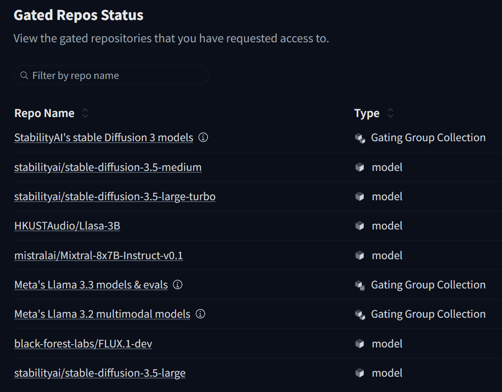

# Gated Models

Some of the scripts used in this little repo are gated models and you need to provide info to get access.

---

The following are currently utilised:

- Stability AI
  - https://huggingface.co/stabilityai/stable-diffusion-3.5-large
  - https://huggingface.co/stabilityai/stable-diffusion-3.5-large-turbo
  - https://huggingface.co/stabilityai/stable-diffusion-3.5-medium
  - https://huggingface.co/stabilityai/stable-diffusion-3-medium
- Mistral AI
  - https://huggingface.co/mistralai/Mixtral-8x7B-Instruct-v0.1

- Black Forest Labs
  - https://huggingface.co/black-forest-labs/FLUX.1-dev

- Meta Llama
  - https://huggingface.co/meta-llama/Llama-3.3-70B-Instruct

---

You should end up with your https://huggingface.co/settings/gated-repos page looking something like this:

