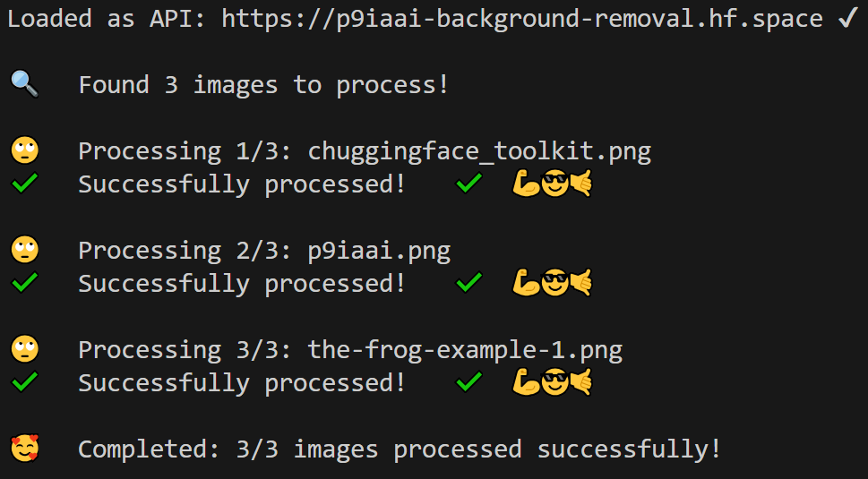

# Background Removal Tool Documentation

## Overview

This tool provides automated background removal for images using 🤗HuggingFace Spaces API. It processes images in batch mode, making it ideal for bulk image processing tasks.

## Usage Instructions

### Input Preparation

1. Place images in the `input/background-removal` folder
2. Ensure images are in supported formats: PNG, JPG/JPEG
3. Verify folder permissions allow read/write access

### Execution

Run the script from the project root directory:

```bash
python tools/background-removal.py
```

### Output

Processed images will be saved in:

```text
output/background-removal
```

### Example Terminal output:



## Performance Expectations

- Average processing time: 2-3 seconds per image
- Maximum image size: 5MB
- Recommended batch size: Up to 100 images per run

## Troubleshooting Guide

### Common Issues

- **Invalid API response**
  - Verify HF_TOKEN is correctly set
  - Check token permissions
  - Ensure API quota is available

- **No output file generated**
  - Verify input image format
  - Check file permissions
  - Ensure image size is within limits

- **Permission errors**
  - Verify folder permissions
  - Check user account privileges
  - Ensure sufficient disk space

---

<div align="center">

**ChuggingFace is very pleased...**


---

**p9iaai**  **2025**

[](https://ko-fi.com/p9iaai)

---

</div>
