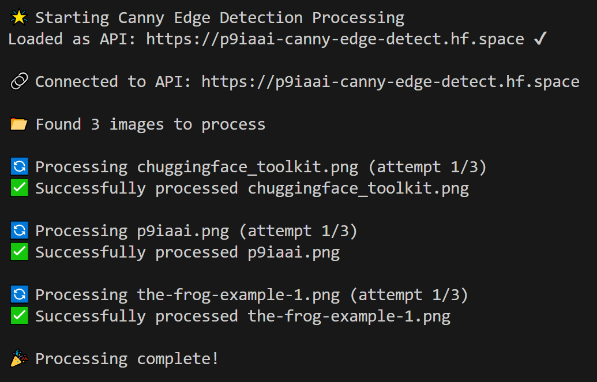

# Canny Edge Detection Tool

This tool processes images using a Canny Edge Detection algorithm through a Hugging Face Space API. It automatically processes all supported images in an input directory and saves the edge-detected versions to an output directory.

## Features

- Batch processing of multiple images
- Supports multiple image formats (PNG, JPG, JPEG, BMP, WEBP)
- Automatic retry mechanism with progressive backoff
- Detailed logging of all operations
- Progress indicators and status messages

## Directory Structure

```text
├── input/canny-edge-detect/      # Place input images here
├── output/canny-edge-detect/     # Edge-detected images saved here
└── .logs/canny-edge-detect.txt   # Operation logs
```

## Usage

1. Place your images in the `input/canny-edge-detect` directory
2. Run the script:

   ```bash
   python tools/canny-edge-detect.py
   ```

3. Find processed images in the `output/canny-edge-detect` directory

## Output

The tool will create edge-detected versions of your images with the following naming convention:

- Input: `example.png`
- Output: `example_edge.png`

## Example Terminal Output



## Error Handling

- The script includes automatic retry logic for failed operations
- Progressive backoff between retries to handle temporary API issues
- Detailed error logging in `.logs/canny-edge-detect.txt`

## Example Outputs

| Input | Output |
| :-: | :-: |
|  |  |
|  |  |
|  |  |

---

<div align="center">

**ChuggingFace is very pleased...**


---

**p9iaai**  **2025**

[](https://ko-fi.com/p9iaai)

---

</div>
