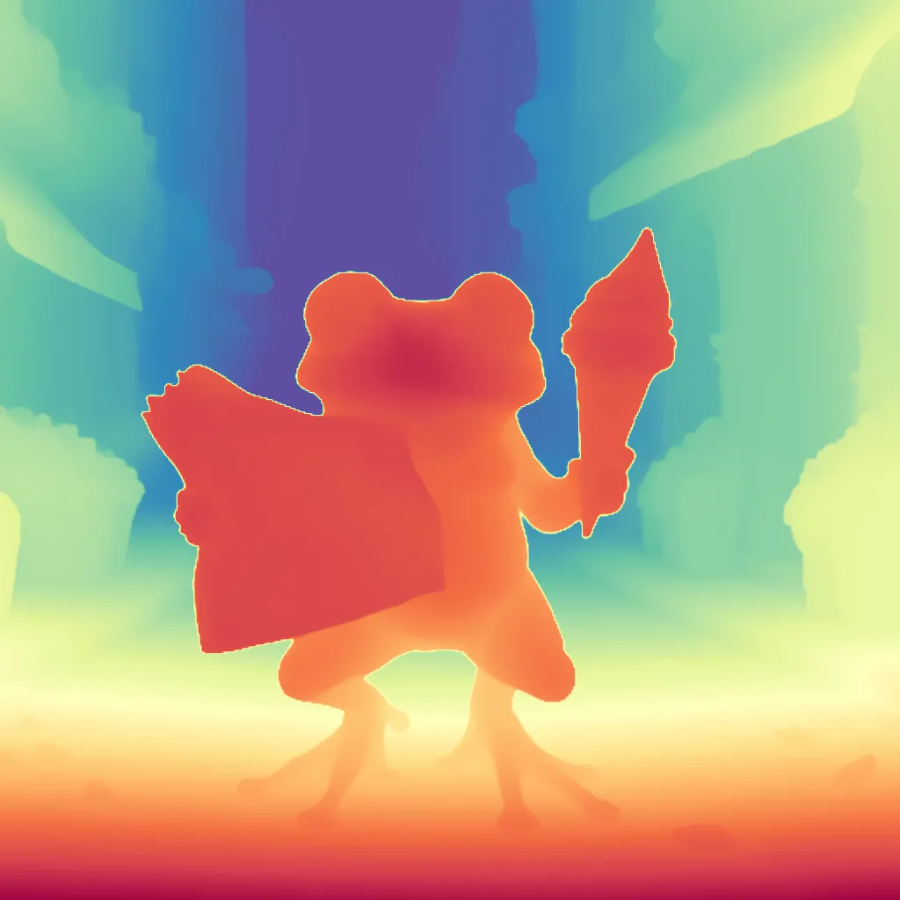
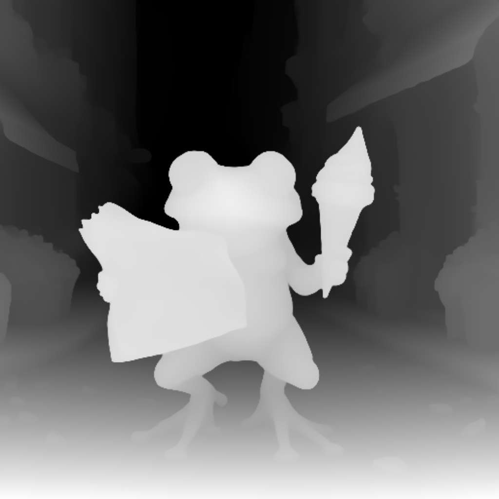
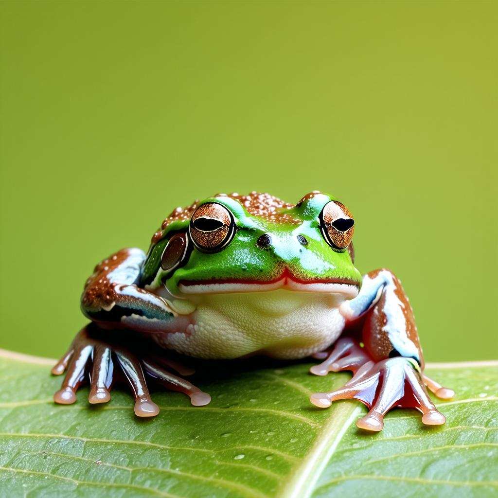
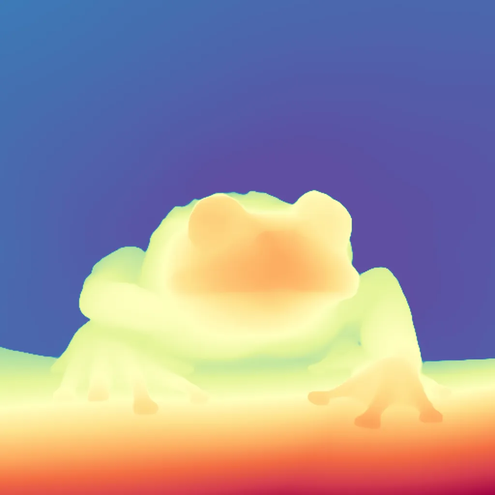
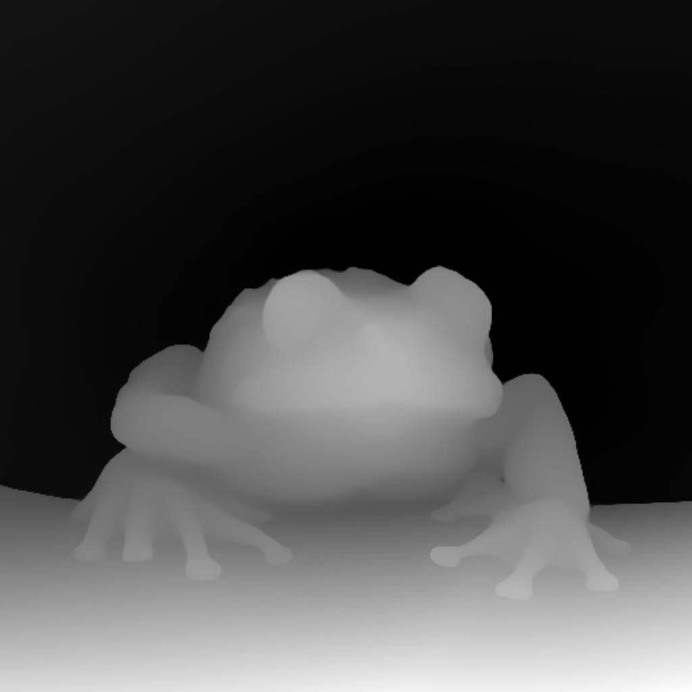

# Depth-Anything Image Processing Documentation

## Overview

This tool processes images using the `p9iaai/Depth-Anything-V2` API to generate both color and grayscale depth maps. It features robust error handling, progress tracking, and detailed logging.

## Key Features

- **Batch Processing**: Automatically processes all images in the input folder
- **Output Naming**: Saves files with descriptive names including original filename, depth map type, and timestamp
- **Retry Mechanism**: Implements exponential backoff for failed API requests
- **Progress Tracking**: Provides real-time updates with clear visual indicators
- **Comprehensive Logging**: Maintains detailed operation logs with timestamps
- **Error Resilience**: Continues processing remaining images after errors

## Folder Structure

Ensure the following directory structure exists:

```text
ChuggingFace-Toolkit/
├── input/
│   └── depth-anything/          # Input images
├── output/
│   └── depth-anything/          # Processed outputs  
├── .logs/                       # Operation logs
└── tools/
    └── depth_anything.py        # Processing script
```

## Usage Instructions

### Input Preparation

1. Place images in `input/depth-anything`
2. Supported formats: PNG, JPG, JPEG
3. Maximum image size: 10MB

### Execution

Run from project root:

```python
python tools/depth_anything.py
```

### Output Files

Processed images are saved in `output/depth-anything` with naming format:

- `{original}_depth_rgb_{timestamp}.png`
- `{original}_depth_bw_{timestamp}.png`

## Configuration Options

Modify these script variables as needed:

```python
INPUT_DIR = "input/depth-anything"    # Input directory
OUTPUT_DIR = "output/depth-anything"  # Output directory  
LOG_DIR = ".logs"                     # Log directory
RETRIES = 3                           # Max retry attempts
INITIAL_BACKOFF = 3                   # Initial retry delay (seconds)
```

## Performance Metrics

- Average processing time: 5-7 seconds per image
- Maximum batch size: 50 images per run
- Recommended image resolution: Up to 1920x1080

## Example Output

### Terminal

```terminal
Loaded as API: https://p9iaai-depth-anything-v2.hf.space ✔

🔍 Processing image 1/2: example1.png
✅ Saved depth maps for example1.png!

🔍 Processing image 2/2: example2.png  
✅ Saved depth maps for example2.png!
```

### Log File

```text
2023-10-15 12:34:56 - INFO - Found 5 images to process
2023-10-15 12:35:01 - INFO - Outputs saved for example1.png
2023-10-15 12:35:10 - INFO - Outputs saved for example2.png
2023-10-15 12:35:15 - WARNING - Retry attempt 1 for example3.png
2023-10-15 12:35:20 - ERROR - Failed to process example3.png
```

## Troubleshooting

### Common Issues

- **API Authentication Failures**
  - Verify HF_TOKEN is set correctly
  - Check token permissions
  - Ensure API quota is available

- **File Processing Errors**
  - Verify image format and size
  - Check folder permissions
  - Ensure sufficient disk space

- **Network Issues**
  - Check internet connection
  - Verify API endpoint availability
  - Increase retry attempts if needed

## Example Results

| Input PNG | Colour Depth Map | Greyscale Depth Map |
| :-: | :-: | :-: |
|  |  |  |
|  |  |  |

---

<div align="center">

**ChuggingFace is very pleased...**


---

**p9iaai**  **2025**

[](https://ko-fi.com/p9iaai)

---

</div>
