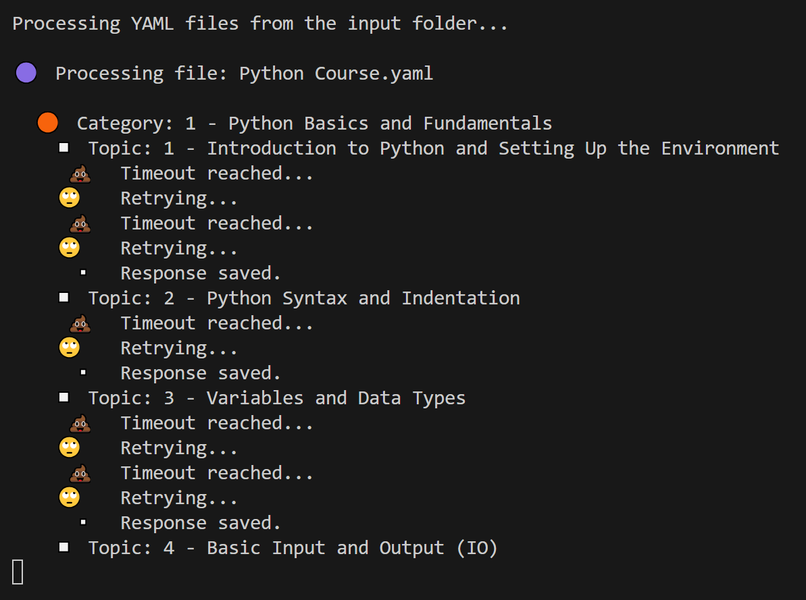

# DocMaker QA Database Builder Scripts

A Python script that automatically generates comprehensive Markdown documentation from YAML input files using 🤗HuggingFace's Inference API.

## Features

- 🗂 Structured documentation generation
- 📄 YAML input format for easy content organization
- 🤖 Integration with Hugging Face's Inference API
- ⏱ Timeout handling for API requests
- 📂 Automatic folder structure creation
- 📝 Markdown file generation
- 📊 Chat history logging
- 🔄 Retry mechanism for failed API requests

## Usage

1. Place your `YAML` files in the `input/docmaker` folder. Example format:

```yaml
1 - The First Amazing Category:
  - Topic 1: 1 - The First Great Topic
  - Topic 2: 2 - The Second Topic
  - Topic 3: 3 - Topic the Third
    etc
    etc

2 - The Second Superb Category:
  - Topic 1: 1 - It's The First Topic in the Second Category!
  - Topic 2: 2 - And This Would be the Second
  - Topic 3: 3 - And What Do You Know, Here's the Third
    etc
    etc
```

2. Run the script from the root:

```python
python tools/docmaker.py
```

3. Generated Markdown files will be saved in `output/docmaker` with the following structure:

```text
output/docmaker/
└── [input_filename]/
    ├── Category 1/
    │   ├── Topic 1.md
    │   ├── Topic 2.md
    │   └── Topic 3.md
    └── Category 2/
        ├── Topic A.md
        └── Topic B.md
```

## Error Handling

The script includes several error handling mechanisms:

- API timeout after 30 seconds
- Automatic retry for failed API requests
- Error logging in console
- Chat history preservation

## Terminal

#### Example Terminal output:



## Maintenance

### Chat History

- Stored in `.logs/docmaker` (one `JSON` file per `YAML` file)
- Contains all prompts and responses for each `YAML` file
- Can be used for debugging or analysis or training

### Environment Variables

- `HF_TOKEN`: Required Hugging Face API token
- `MODEL`: Can be changed to use different models (default: `Qwen/Qwen2.5-Coder-32B-Instruct`)

### Configuration

- `TIMEOUT`: API request timeout in seconds (default: `30`)
- `INPUT_FOLDER`: Location of `YAML` input files (default: `input/docmaker`)
- `OUTPUT_FOLDER`: Location for generated Markdown files (default: `output/docmaker`)

---

<div align="center">

**ChuggingFace is very pleased...**


---

**p9iaai**  **2025**

[](https://ko-fi.com/p9iaai)

---

</div>
