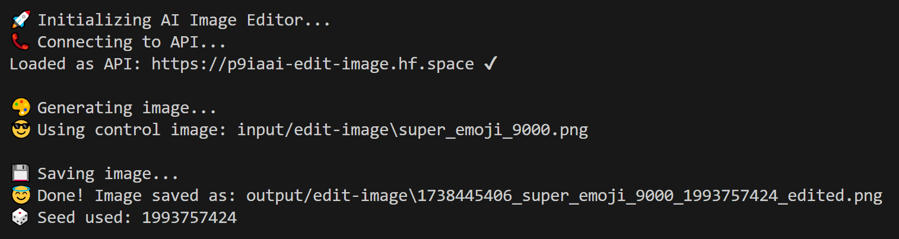

# Edit Image

A command-line tool that uses `Black Forest Labs` `FLUX.1-Canny-dev` model to edit images based on text prompts. This tool leverages the model to transform images according to your descriptions.

## Directory Structure

```text
├── input
│   └── edit-image/     # Place input PNG images here
├── output
│   └── edit-image/     # Generated images are saved here
└── .logs
    └── edit-image.txt  # Operation logs
```

## Usage

Basic usage:

```terminal
python tools/edit-image.py "your prompt here"
```

The script will use the first PNG file it finds in the `input/edit-image` directory. If no PNG files are found, it will download a default test image.

### Arguments

| Argument | Description | Default |
|----------|-------------|---------|
| prompt | Text description of desired image changes (required) | - |
| --image | Path to specific input image | First PNG in input dir |
| --width | Output image width | 1024 |
| --height | Output image height | 1024 |
| --seed | Random seed for generation | 0 |
| --steps | Number of inference steps | 28 |
| --guidance | Guidance scale for generation | 30 |

### Example Commands

1. Basic image edit using default settings:

```terminal
python tools/edit-image.py "make the sky more dramatic"
```

2. Specify a custom input image:

```terminal
python tools/edit-image.py "add snow to the scene" --image input/edit-image/summer.png
```

3. Custom size and generation parameters:

```terminal
python tools/edit-image.py "add a sunset glow" --width 1920 --height 1080 --guidance 25 --steps 35
```

4. Use specific seed for reproducible results:

```terminal
python tools/edit-image.py "make it night time" --seed 42
```

### Example Prompts

- "Make the colors more vibrant"
- "Convert to winter scene"
- "Add dramatic lighting"
- "Make it look like a watercolor painting"
- "Add fog to the background"
- "Change to sunset lighting"
- "Make it look more cinematic"
- "Add rain effects"

## Terminal Output Example



## Output

- Generated images are saved as PNG files in the `output/edit-image` directory
- Output filename format: `{timestamp}_{input_filename}_{used_seed}_edited.png`
  - timestamp: Unix timestamp
  - input_filename: Name of the input file (without extension)
  - used_seed: Seed value used for generation
- The script provides 💩emoji-based progress updates in the terminal
- All operations are logged to `.logs/edit-image.txt`

### Example Output Filename

```text
1706824511_summer_42_edited.png
```

Where:

- 1706824511 is the Unix timestamp
- summer is the input filename
- 42 is the seed used
- _edited.png is the suffix

## Example Outputs

Below is a sample of three different outputs using the same prompt. Seed is randomized by default so each generation will give you a different result unless specified (see above).

<div align="center">

**PROMPT:** Make the text rainbow colours

| Input | Output 1 | Output 2 | Output 3 |
| :-: | :-: | :-: | :-: |
|  | |  |  |

Click images to see them full size.

</div>

## Notes

- Input images are automatically converted to RGB format if necessary
- The script maintains the original image while creating edited versions
- Higher guidance values (e.g., 30) result in stronger adherence to the prompt
- More inference steps generally lead to higher quality but slower generation
- The seed value can be used to reproduce specific results or variations
- Transparency is removed during the process
  - You can run outputs through `background-removal.py` if required

---

<div align="center">

**ChuggingFace is very pleased...**


---

**p9iaai**  **2025**

[](https://ko-fi.com/p9iaai)

---

</div>
