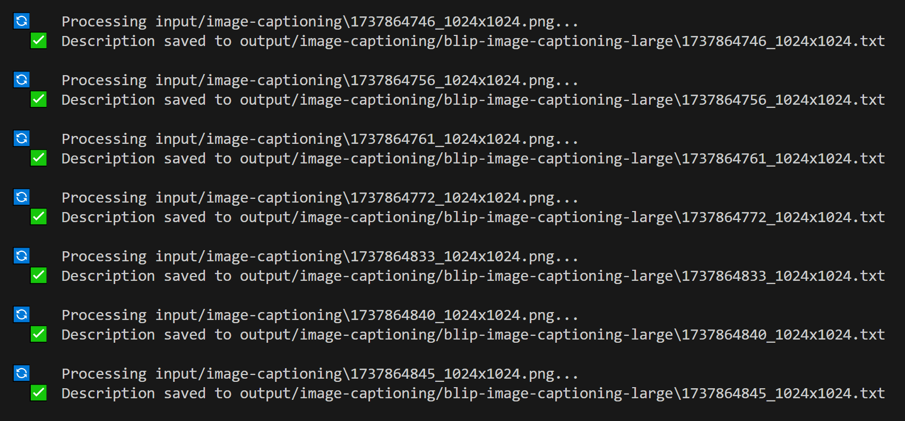

# BLIP Image Captioning Large

This project provides a Python script for generating captions for images using the Salesforce BLIP (Bootstrapped Language-Image Pretraining) model through the 🤗HuggingFace API.

## Features

- Processes images in bulk from an input folder
- Saves generated captions in text files
- Maintains a detailed log of all processed images
- Supports common image formats (PNG, JPG, JPEG, GIF, BMP)

## Usage

1. Place your images in the `input/image-captioning` directory

2. Run the script from the root:

```python
python tools/image-captioning.py
```

The script will:

- Process all images in the input folder
- Generate captions using the BLIP model
- Save each caption in a corresponding text file in the output folder
- Create detailed logs in `.logs/image-captioning.txt`

## Terminal

#### Example Terminal output:



## Input/Output Format

### Input

- Supported image formats: PNG, JPG, JPEG, GIF, BMP
- Place images in: `input/image-captioning`

### Output

- Text files containing generated captions
- Saved in: `output/image-captioning/{model}`
- File naming: `[original_image_name].txt`

## Logging

Detailed logs are maintained in `.logs/image-captioning.txt` with the following format:

```text
IMAGE:         input/image-captioning/example.jpg
DESCRIPTION:   a cat sitting on a windowsill looking outside
FILENAME:      example.txt
MODEL:         blip-image-captioning-large
```

## Error Handling

- The script will raise exceptions for:
  - Missing or invalid Hugging Face token
  - HTTP errors from the API
  - Invalid image files
- Failed processing attempts are logged with appropriate error messages

## Model Information

This script uses the Salesforce BLIP (Bootstrapped Language-Image Pretraining) model:

- Model name: Salesforce/blip-image-captioning-large
- Model card: https://huggingface.co/Salesforce/blip-image-captioning-large
- Capabilities: Generates natural language descriptions of images
- Input: Image files
- Output: Textual description of the image

If you want to use a different model, find one on 🤗HuggingFace and change the endpoint in the script.

## Example

Given an image `example.jpg` in the input folder, the script will:

1. Generate a caption using the BLIP model
2. Save the caption to `output/image-captioning/{model}/example.txt`
3. Log the processing details

## Notes

- The script automatically creates necessary directories if they don't exist
- Processing time depends on image size and API response time
- Ensure your Hugging Face token has sufficient permissions for the model

---

<div align="center">

**ChuggingFace is very pleased...**


---

**p9iaai**  **2025**

[](https://ko-fi.com/p9iaai)

---

</div>
