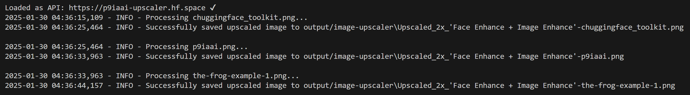

# Bulk Image Upscaling Script

A Python script for upscaling images using the Gradio client to interact with a 🤗HuggingFace Space.

## Features

- Upscale images with configurable scaling factor
- Multiple enhancement modes:
  - Only Face Enhance
  - Only Image Enhance
  - Face Enhance + Image Enhance
- Automatic directory creation
- Comprehensive logging
- Colored console output
- Error handling with detailed error messages

## Usage

### Basic Usage

1. Place your images in the `input/image-upscaler` directory
2. Run the script from the root:

```bash
python tools/image-upscaler.py
```

3. Find upscaled images in `output/image-upscaler`

### Configuration

You can customize the upscaling process by modifying the parameters in the `upscale_images` function:

```python
upscale_images(
    input_dir=r"input/image-upscaler",      # Input directory
    output_dir=r"output/image-upscaler",    # Output directory
    scale=2,                                # Upscaling factor (2, 3, or 4x)
    enhance_mode='Only Image Enhance'       # Enhancement mode
)
```

### Enhancement Modes

- `Only Face Enhance`: Enhances only facial features
- `Only Image Enhance`: Enhances the entire image
- `Face Enhance + Image Enhance`: Enhances both facial features and the entire image

## Terminal

#### Example Terminal output:



## Filenames

Filenames are output in the following format `Upscaled_{scale}x_'{enhance_mode}'-{image_file}`:

- `Upscaled_2x_'Only Image Enhance'-huggingface_toolkit.png`

## Logging

The script logs all activities to both console and file:

- Log files are stored in `.logs/image-upscaler.txt`

Log levels:

- INFO: General processing information
- WARNING: Non-critical issues
- ERROR: Processing failures

## Error Handling

The script includes comprehensive error handling:

- Invalid input directories
- Missing or invalid images
- API connection issues
- File system errors

All errors are logged with detailed information for troubleshooting.

---

<div align="center">

**ChuggingFace is very pleased...**


---

**p9iaai**  **2025**

[](https://ko-fi.com/p9iaai)

---

</div>
