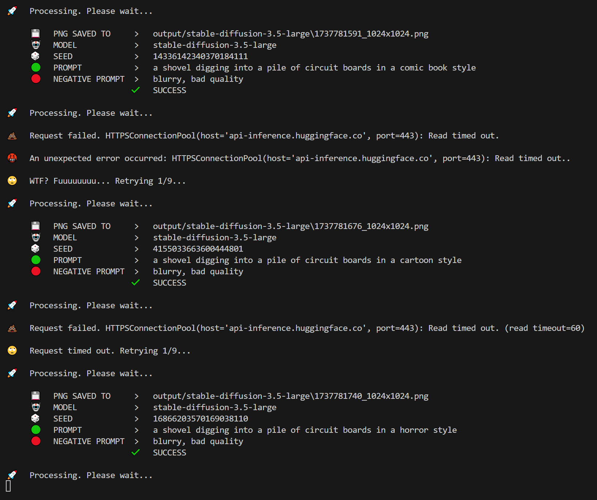

# Stable Diffusion Image Generation Script

This script generates images based on text prompts using the `🤗HuggingFace` Serverless Inference API. It supports a number of `Stable Diffusion` models and includes robust error handling, retry mechanisms, and logging.

---

## Table of Contents

1. [Features](#features)
2. [Usage](#usage)
3. [Parameters](#parameters)
4. [Output](#output)
5. [Logs](#logs)
6. [Terminal](#terminal)
7. [Example Prompts](#example-prompts)
8. [Troubleshooting](#troubleshooting)

---

## Features

- **Text-to-Image Generation**: Generate images from text prompts using 🤗HuggingFace Serverless Inference API models.
- **Robust Error Handling**: Retry mechanism with exponential backoff for handling API errors and timeouts.
- **Logging**: Save prompts, seeds, and output paths to a log file for easy tracking.
- **Customizable Parameters**: Adjust image dimensions, guidance scale, number of inference steps, and more.

---

## Usage

### Basic Usage (run scripts from project root)

To generate an image using `stable-diffusion-3.5-large`:

```python
generate_image("a futuristic cityscape at sunset")
```

## Parameters

### `generate_image` Function

| Parameter         | Type  | Default Value    | Description |
|------------------|------|----------------|-------------|
| `prompt`        | `str`  | **Required**    | The text prompt to generate the image. |
| `negative_prompt` | `str`  | `blurry, bad quality` | The negative text prompt to generate the image. |
| `model`         | `str`  | `"stable-diffusion-3.5-large"` | The model to use. |
| `guidance_scale` | `float` | `4.5` | Controls how closely the image follows the prompt. Higher values = stricter. |
| `num_inference_steps` | `int` | `40` | The number of denoising steps. More steps = higher quality (but slower). |
| `width`         | `int`  | `1024` | The width of the output image in pixels. |
| `height`        | `int`  | `1024`  | The height of the output image in pixels. |
| `max_retries`   | `int`  | `9`    | The maximum number of retries for failed requests. |


---

## Output

### Image Files

- Images are saved in the `output/{model}` directory.
- Filename format: `{timestamp}_{width}x{height}.png`

#### Example:

```text
output/stable-diffusion-3.5-large/1737304723_1024x576.png
```

## Logs

### Log Files

- Log is saved in the `.logs` directory.
- Filename: `stable-diffusion.txt`

#### Example log entry:

```text
   PNG SAVED TO       output/stable-diffusion-3.5-large\1737864019_1024x1024.png
          MODEL       stable-diffusion-3.5-large
           SEED       17057244650720608408
       GUIDANCE       5.0
          STEPS       45
     RESOLUTION       1024x1024
         PROMPT       A Python slithering over a pile of brains in a comic book style
NEGATIVE PROMPT       blurry, low resolution, distorted, overexposed

   PNG SAVED TO       output/stable-diffusion-3.5-large\1737864063_1024x1024.png
          MODEL       stable-diffusion-3.5-large
           SEED       6383667167046580540
       GUIDANCE       5.0
          STEPS       45
     RESOLUTION       1024x1024
         PROMPT       A Python slithering over a pile of brains in a comic book style
NEGATIVE PROMPT       blurry, low resolution, distorted, overexposed
```

## Terminal

#### Example Terminal output:



## Example Prompts

### Here are some fun and creative prompts you can use:

```python
generate_image("a sentient toaster wearing a top hat and monocle, hosting a tea party for other kitchen appliances")
generate_image("a group of squirrels playing poker in a tree, with one squirrel dramatically revealing a royal flush")
generate_image("a giant rubber duck floating in a bathtub ocean, with tiny sailboats sailing around it")
generate_image("a cat dressed as a medieval knight, riding a Roomba into battle against a horde of vacuum cleaners")
generate_image("a penguin in a Hawaiian shirt, surfing on a wave made of ice cubes in the middle of a desert")
generate_image("a raccoon wearing a lab coat, conducting experiments on a pile of glitter and marshmallows")
generate_image("a banana wearing sunglasses, skateboarding down a rainbow while being chased by a gang of jealous oranges")
generate_image("a dragon wearing a chef's hat, grilling marshmallows with its fire breath while unicorns watch in awe")
generate_image("a group of robots having a dance-off in a futuristic nightclub, with lasers and disco balls everywhere")
generate_image("a sloth dressed as a superhero, flying through the sky at the speed of 'meh' while eating a taco")
```

## Troubleshooting

### Common Issues

1. **API Timeouts:**

    - Increase the timeout parameter in the `generate_image_with_timeout` function.
    - Ensure your internet connection is stable.

2. **Model Not Ready:**

    - The script automatically retries with the `x-wait-for-model` header. If the model is still not ready, check the 🤗HuggingFace API status.

3. **Invalid Model Name:**

    - Ensure the model name is correct - e.g. `stable-diffusion-3.5-large`.

4. **Missing .env File:**

    - Ensure the `.env` file exists and contains your 🤗HuggingFace API token.

5. **Speed:**

    - Don't expect this script to be particularly quick.  It will process all of your prompts (unless it skips after max retries) but we are dealing with a free API that is sufficiently busy most of the time.  Best advice is go grab a drink and let it run if you're processing a lot of prompts.  I've successully tested with over 100 prompts with no issue, other than the wait of course.

---

<div align="center">

**ChuggingFace is very pleased...**


---

**p9iaai**  **2025**

[](https://ko-fi.com/p9iaai)

---

</div>
