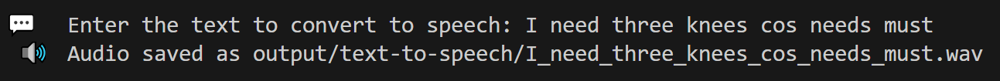

# Suno Bark Text-to-Speech Script

This Python script uses the Suno Bark model from 🤗HuggingFace to convert text input into audio files.

## Features

- Converts text to speech using the Suno Bark model
- Automatically sanitizes input text to create valid filenames
- Saves output as .wav files in the `output/text-to-speech/` directory

## Usage

1. Run the script from the root:

```bash
python tools/text-to-speech.py
```

2. Enter the text you want to convert when prompted

3. The audio file will be saved in the `output/text-to-speech/` directory

## File Structure

```text
.
├── tools/
│   └── suno-bark-tts.py    # Main script
└── output/
    └── suno-bark/          # Directory for audio output
```

## API Details

- Model: [suno/bark](https://huggingface.co/suno/bark)
- Endpoint: `https://api-inference.huggingface.co/models/suno/bark`
- Authorization: Bearer token required (`HF_TOKEN` in `.env`)

## Example

```bash
python tools/text-to-speech.py
```

## Terminal

#### Example Terminal output:



## Notes

- Output files are saved as .wav format
- Filenames are automatically generated from input text:
  - Special characters are removed
  - Spaces are replaced with underscores
  - Length is limited to 50 characters
- Ensure the `output/text-to-speech/` directory exists before running the script
- The model is uncensored.

---

<div align="center">

**ChuggingFace is very pleased...**


---

**p9iaai**  **2025**

[](https://ko-fi.com/p9iaai)

---

</div>
